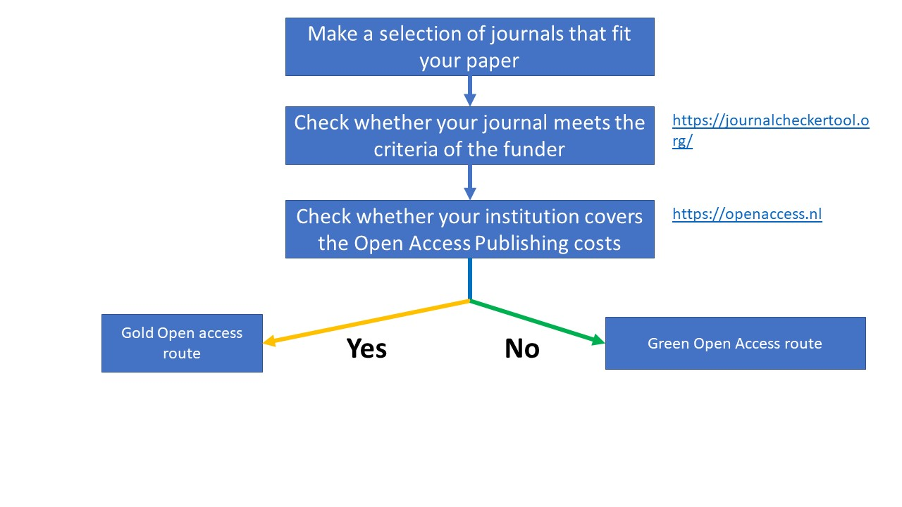

<h1> Open Access Publishing </h1>

<h2> What is Open Access Publishing </h2>
When we publish a paper open access, it means there are no financial, legal or technical barriers to access the paper. Thus anyone with an internet connection can find, read, download, and print the paper. It is a publishing model for scholarly communication that makes information available to readers at no cost.  
This way, we can share infromation with others easily, which can drive research discoveries forward.
 

<h2> NWO: open access publising </h2>
NWO aims for 100 percent Open Access. Therefore NWO requires that all publications emerging from research it funds must be made available in Open Access immediately upon publication. NWO accepts different routes to Open Access, including the Gold and Green route. For more information see <a href="https://www.nwo.nl/en/open-access-publishing"> NWO and open access</a>.

<h2> Workflow to select a route </h2>

